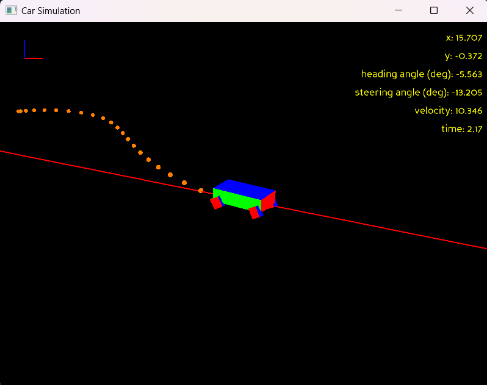

# autonomous-vehicle-simulation

This project is a simulation written in Python utilizing the `RK45` numerical integration algorithm to show potential control of an autonomous vehicle. This simulation implements a PID controller to achieve a desired velocity and y-axis offset from given initial conditions and an Extended Kalman filter to estimate state from modeled sensors. Results are displayed in 3D using [panda3d](https://www.panda3d.org/) with 2D plotting also available via [matplotlib](https://matplotlib.org/).

_Example 3D visualization:_

_Example plot visualization:_

## Running

With Python installed, you can run `pip install numpy panda3d scipy matplotlib` to install the necessary libraries. Then you can run `python` in a command terminal and enter the path to the `Simulations.py` file to run the default simulation.

## Modeling and Simulation

This simulation uses a simplified model of a 2D vehicle. As such, side slip, suspensions, and other variables are not considered. The simplified equations of motion used in the state-space representation are as follows:

$$\dot{x} = v*cos(\theta)$$

$$\dot{y} = v*sin(\theta)$$

$$\dot{\theta} = v/L*tan(\delta)$$

$$\dot{v} = \alpha$$

$$\dot{\gamma} = 0$$

With input vector:

$$ u = [\alpha,  \delta] $$

Where:

$$ v \text{ is the speed in the car's forward direction} $$

$$ \theta \text{ is the heading angle with respect to the x-axis} $$

$$ \delta \text{ is a steering angle} $$

$$ \alpha \text{ is acceleration} $$

## Extended Kalman Filter

An Extended Kalman Filter (EKF) is implemented to estimate the state of the vehicle from noisy sensor measurements. The EKF is a nonlinear version of the Kalman Filter which linearizes about the current mean and covariance. The state vector for the EKF includes the position, heading, and velocity of the vehicle.

The prediction step uses the vehicle's motion model to predict the next state, while the update step incorporates the sensor measurements to correct the state estimate. The equations for the EKF are as follows:

### Prediction Step

$$ \hat{x}_{k|k-1} = f \hat{x}_{k-1|k-1}, u_k $$

$$ P_{k|k-1} = F_k P_{k-1|k-1} F_k^T + Q_k $$

### Update Step

$$ K_k = P_{k|k-1} H_k^T (H_k P_{k|k-1} H_k^T + R_k)^{-1} $$

$$ \hat{x}_{k|k} = \hat{x}_{k|k-1} + K_k (z_k - h\hat{x}_{k|k-1}) $$

$$ P_{k|k} = (I - K_k H_k) P_{k|k-1} $$

Where:

$$ \hat{x}_{k|k-1} \text{ is the predicted state estimate} $$

$$ P_{k|k-1} \text{ is the predicted estimate covariance} $$

$$ F_k \text{ is the Jacobian of the motion model} $$

$$ Q_k \text{ is the process noise covariance} $$

$$ K_k \text{ is the Kalman gain} $$

$$ H_k \text{ is the Jacobian of the measurement model} $$

$$ R_k \text{ is the measurement noise covariance} $$

$$ z_k \text{ is the measurement vector} $$

$$ h \hat{x}_{k|k-1} \text{ is the measurement model} $$
